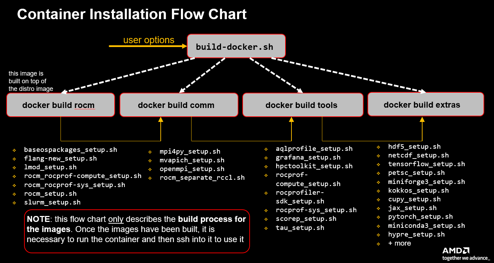

# 1. Synopsis

Welcome to AMD's model installation repo!

In this repo, we provide two options to test the installation of a variety of AMD GPU software and frameworks that support running on AMD GPUs:
1. Container Installation (based on **Docker**)
2. Bare Metal Installation

## 1.2 Podman

If `Podman` is installed on your system instead of Docker, the scripts will detect it and automatically include the `--format docker` flag in the `docker build` commands present in our scripts.

## 1.3 Singularity

If Singularity is installed in your system, it is possible to create a Singularity image using the installation scripts in this repo. First, make a new directory from which the Singularity image will be built, and record the location of this directory:

```bash
mkdir singularity_dir
export SINGULARITY_DIR_PATH=$PWD
```

Note that the location where you created the above directory needs to have enough storage space available. Then, start up a Singularity image with the `--sandbox` option, pulling from a plain Docker image for Ubuntu 22.04 (for instance):

```bash
singularity build --sandbox container docker://ubuntu:22.04
```

The next step is to install software in the directory:

```bash
singularity shell -e --writable --fakeroot  -H $PWD:/home ${SINGULARITY_DIR_PATH}/singularity_dir
```

The above command will take care of several things: the `shell` command allows us to run shell scripts in the `singularity_dir`. The input flag `--fakeroot` will make the use of `sudo` not necessary, and the `-e` flag will clear your environment from anything coming from the host (i.e. the system from which you ae running Singularity commands) before getting on the `singularity_dir` directory. Finally the `-H` option makes your current directory your home directory once in `singularity_dir`.

**NOTE**: Changes made to host directories modified while using Singularity  will reflect once exited.

Once this command has completed, run `bare_metal/main_setup.sh +options` as explained in [Section 2.2](#2.2-training-enviroment-install-on-bare-system).

The final step is to create a Singularity image `singularity_image` from the `singularity_dir` directory:

```bash
singularity build ${SINGULARITY_DIR_PATH}/singularity_dir ${SINGULARITY_DIR_PATH}/singularity_image.sif
```

The above command will create the image `singularity_image.sif` and place it in `SINGULARITY_DIR_PATH`. To run the image do:

```bash
singularity run -e ${SINGULARITY_DIR_PATH}/singularity_image.sif
```

**NOTE**: Once again, note that changes made while on the image to the directories from the host that are mirrored to the image will reflect once you exit the image.

## 1.4 Operative System Info

Currently, we are only supporting an Ubuntu operating system (OS), but work is underway to add support for Red Hat, Suse and Debian.

## 1.1 Supported Hardware

Data Center GPUs, Workstation GPUs and Desktop GPUs are currently supported.

Data Center GPUs (necessary for multi-node scaling as well as more GPU muscle): `AMD Instinct MI300A, MI250X, MI250, MI210, MI100, MI50, MI25`

Workstation GPUs (may give usable single GPU performance) : `AMD Radeon Pro W6800, V620, VII`

Desktop GPUs (more limited in memory): `AMD Radeon VII`

**NOTE**: Others not listed may work, but have limited support. A [list]( https://llvm.org/docs/AMDGPUUsage.html#processors)
of AMD GPUs in LLVM docs may help identify compiler support.

# 2. Model Installation Setup Instructions

We currently provide two options for the setup of the software: a container (based on Docker), and a bare system install. The latter can be tested with a container before deployment.  

## 2.1 Training Docker Container Build Steps

These instructions will setup a container on `localhost` and assume that:
1. Docker or Podman are installed.
2. For Docker, your userid is part of the Docker group.
3. For Docker, you can issue Docker commands without `sudo`.
 
### 2.1.1  Building the Four Images of the Container 
The container is set up to use Ubuntu 22.04 as OS, and will build four different images called `rocm`, `comm`,  `tools` and `extras`. 
Here is a flowchart of the container installation process
<p>

</p>

This documentation considers version 6.1.0 of ROCm as an example. The ROCm version can be specified at build time as an input flag. 

**NOTE**: With the release of ROCm [6.2](https://github.com/ROCm/ROCm/releases), `Omnitrace` and `Omniperf` are included in the ROCm stack. In the container installation, if `--rocm-versions` includes 6.2, the Omnitrace and Omniperf versions installed are:

1. The built-in versions included in the ROCm 6.2 software stack. These can be used by loading: `module load omnitrace/6.2.0`, `module load omniperf/6.2.0`.

2. The latest versions from AMD Research that would be used for ROCm releases < 6.2. These can be used by loading: `module load omnitrace/1.11.3`, `module load omniperf/2.0.0`.

Several compilers and other dependencies will be built as part of the images setup (more on this later). First, clone this repo and go into the folder where the Docker build script lives: 

```bash
git clone --recursive git@github.com:amd/HPCTrainingDock.git
cd HPCTrainingDock
```

To build the four images, run the following command (note that `<admin>` is set to `admin` by default but the password **must** be specified, otherwise you will get an error from the build script):

```
   ./build-docker.sh --rocm-versions 6.1.0 --distro ubuntu --distro-versions 22.04 --admin-username <admin> --admin-password <password>
```

To visualize all the input flags that can be provided to the script, run: `./build-docker.sh --help`.

**NOTE**: In some OS cases, when launching the installation scripts it may be necessary to explictly include the  `--distro` option to avoid "7 arguments instead of 1" type of errors.

To show more docker build output, add this option to the build command above:

```bash
--output-verbosity 
```

**NOTE**: The docker build script will try and detect the GPU on the system you are building on, but you can also have it build for a different GPU model than your local GPU, by specifying the target architecture with the `--amdgpu-gfxmodel` option. For instance, to build for the MI200 series data center GPU we would provide this:

```bash
--amdgpu-gfxmodel=gfx90a
```

For the MI200 series, the value to specify is `gfx90a`, for the MI300 series, the value is `gfx942`. Note that you can also build the images on a machine that does not have any GPU hardware (such as your laptop) provided you specify a target hardware with the flag above.

Omnitrace will by default download a pre-built version. You can also build from source,
which is useful if the right version of omnitrace is not available as pre-built. To build omnitrace from source, append the following to the build command above:

```
--omnitrace-build-from-source
```

Building extra compilers takes a long time, but a cached option can be used  to shorten subsequent build times, just append these options to the build command above:

```bash
--build-gcc-option 
--build-aomp-option 
```

The first one builds the latest version of `gcc` for offloading, the second builds the latest version of `LLVM` for offloading. Once a version of these compilers is built, they can be tarred up and placed in the following directory structure:

```bash
CacheFiles/:
  ubuntu-22.04-rocm-5.6.0
     aomp_18.0-1.tgz
      gcc-13.2.0.tgz
```

Then, the cached versions can be installed specifying:

```bash
---use-cached-apps 
```
The above flag will allow you to use pre-built `gcc` and `aomp` located in `CacheFiles/${DISTRO}-${DISTRO_VERSION}-rocm-${ROCM_VERSION}`.

### 2.1.2 Previewing the Images
 
Assuming that the build of the images has been successful, you can see details on the images that have been built by doing:

```bash
 docker images 
```
which will have an output similar to this one:

```bash
 REPOSITORY           TAG                                    IMAGE ID       CREATED          SIZE
 training             latest                                 fe63d37c10f4   40 minutes ago   27GB
 <admin>/tools       release-base-ubuntu-22.04-rocm-6.1.0   4ecc6b7a80f2   44 minutes ago   18.7GB
 <admin>/comm        release-base-ubuntu-22.04-rocm-6.1.0   37a84bef709a   47 minutes ago   16.1GB
 <admin>/rocm        release-base-ubuntu-22.04-rocm-6.1.0   bd8ca598d8a0   48 minutes ago   16.1GB
```
You can also display the operating system running on the container by doing:

```bash
cat ../../etc/os-release
```

### 2.1.3 Starting the Container

To start the container, run:

```bash
docker run -it --device=/dev/kfd --device=/dev/dri --group-add video -p 2222:22 --detach --name Training --rm -v $HOME/Class/training/hostdir:/hostdir --security-opt seccomp=unconfined docker.io/library/training
```

**NOTE**: If you are testing the container on a machine that does not have a GPU (such as your laptop), you need to remove the `--device=/dev/kfd` option from the above command. 

You can check what containers are running by running `docker ps`.

### 2.1.4 Accessing the Container

It is necessary to wait a few seconds for the container to start up, before you will be allowed to login.
After the container started, you can log in by doing:

```bash
ssh <admin>@localhost -p 2222
```
and then enter the password `<password>` specified when building the images. If you get the message below, wait a little longer, the container is still starting up:

```bash
kex_exchange_identification: read: Connection reset by peer
Connection reset by 127.0.0.1 port 2222
```

Once you are in, you can startup slurm with the manage script `manage.sh` located in the `bin` directory. To transfer files from your local system to the container, run: 

```bash
rsync -avz -e "ssh -p 2222" <file> <admin>@localhost:<path/to/destination>
```

### 2.1.5 Killing the Container and Cleaning Up your System

To exit the container, just do:
```bash
exit
```
Note that the container will still be running in the background. To kill it, do:

```bash
docker kill Training
```

To clean up your system, run:

```bash
docker rmi -f $(docker images -q)
docker system prune -a
```

## 2.2 Training Enviroment Install on Bare System

In this section, we provide instrucitons on how to install AMD GPU software on a bare system. This is achieved with the same set of scripts used for the setup of the Docker container, except that instead of being called from within a Dockerfile, they are called from a top level script that does not require the use of Docker. There is however a script called `test_install.sh` that will run a Docker container to test the bare system install. 

To test the bare system install, do:

```bash
git clone --recursive git@github.com:amd/HPCTrainingDock.git && \
cd HPCTrainingDock && \
./bare_system/test_install.sh --rocm-version <rocm-version>
```

The above command sequence will clone this repo and then execute the `test_install.sh` script. This script calls a the `main_install.sh` which is what you would execute to perform the actual installation on your system. The `test_install.sh` sets up a Docker container where you can test the installation of the software before proceeding to deploy it on your actual system by running `main_install.sh`. The `test_install.sh` script automatically runs the Docker container after it is built, and you can inspect it as `sysadmin`. Here is a flowchart of the process initiated by the script:

<p>

</p>

As seen form the image above, setting `--use-makefile 1` option will bypass the installation of the scripts and automatically get you on the container, on which packages can be installed with `make <package>` and then tested with `make <package_tests>`.
To visualize all the input flags that can be provided to the script, run: `./bare_system/test_install.sh --help`.

If you are satisfied with the test installation, you can proceed with the actual installation on your system by doing:

```bash
git clone --recursive git@github.com:amd/HPCTrainingDock.git && \
cd HPCTrainingDock && \
./bare_system/main_install.sh --rocm-version <rocm-version>
```

The above command will execute the `main_install.sh` script on your system that will proceed with the installation for you. Note that you need to be able to run `sudo` on your system for things to work.  To visualize all the input flags that can be provided to the script, run: `./bare_system/main_setup.sh --help`.
The `main_install.sh` script calls a series of other scripts to install the software (these are given several runtime flags that are not reported here for simplicity):

```bash
 // install linux software such as cmake and system compilers
rocm/sources/scripts/baseospackages_setup.sh

// install lmod and create the modulepath
rocm/sources/scripts/lmod_setup.sh 

// install ROCm and create ROCm module
rocm/sources/scripts/rocm_setup.sh 

// install OpenMPI and create OpenMPI module
comm/sources/scripts/openmpi_setup.sh 

// install MVAPICH and create MVAPICH module
comm/sources/scripts/mvapich_setup.sh 

// install MPI4PY and create MPI4PY module
comm/sources/scripts/mpi4py_setup.sh 

// install Miniconda3 and create Miniconda3 module
tools/sources/scripts/miniconda3_setup.sh 

// install AMD Research Omnitrace and create module
tools/sources/scripts/omnitrace_setup.sh 

// install Grafana (needed for Omniperf)
tools/sources/scripts/grafana_setup.sh

// install AMD Research Omniperf and create module
tools/sources/scripts/omniperf_setup.sh 

// install HPCToolkit and create HPCToolkit module
tools/sources/scripts/hpctoolkit_setup.sh 

// install TAU and create TAU module
tools/sources/scripts/tau_setup.sh 

// install clang/14  clang/15  gcc/11  gcc/12  gcc/13 and create modules
extras/sources/scripts/compiler_setup.sh

// install liblapack and libopenblas
extras/sources/scripts/apps_setup_basic.sh

// install CuPy and create CuPy module
extras/sources/scripts/cupy_setup.sh 

// install JAX and create JAX module
extras/sources/scripts/jax_setup.sh 

// install PyTorch and create PyTorch module
extras/sources/scripts/pytorch_setup.sh 

// install additional libs and apps such as valgrind, boost, parmetis, openssl, etc.
extras/sources/scripts/apps_setup.sh

// install Kokkos
extras/sources/scripts/kokkos_setup.sh

```

**NOTE**: As mentioned before, those scripts are the same used by the Docker containers (either the actual training Docker container or the test Docker container run by `test_install.sh`). The reason why the script work for both installations (bare system and Docker) is because the commands are executed at the `sudo` level. Since Docker is already at the `sudo` level, the instructions in the scripts work in both contexts.


### 2.2.1 Alternative installation directory for ROCm

There is a possibility to install ROCm outside of the usual `/opt/`. `test_install.sh` and `main_install.sh` scripts have optional argument `--rocm-install-path` which allows to specify the desired path for ROCm:

```bash
./bare_system/test_install.sh --rocm-version <rocm-version> --rocm-install-path <new_path>
```

If the argument `--rocm-install-path` is specified, installation scripts will first install ROCm to the usual `/opt/` path, then move it to the `<new_path>` location, and finally update `/etc/alternatives/rocm` and module files.

**NOTE**: In general, if you are moving ROCm folder outside of the usual `/opt/`, it is very important not to forget to update new path in all of its dependencies and module files.


# 3. Inspecting the Model Installation Environment

The training environment comes with a variety of modules installed, with their necessary dependencies. To inspect the modules available, run `module avail`, which will show you this output (assuming the installation has been performed with ROCm 6.1.2):

```bash
------------------------------------------------------------------ /etc/lmod/modules/Linux -------------------------------------------------------------------
clang/base clang/14 (D) clang/15 gcc/base gcc/11 (D) gcc/12 gcc/13 miniconda3/23.11.0
------------------------------------------------------------------- /etc/lmod/modules/ROCm -------------------------------------------------------------------
amdclang/17.0-6.1.2 hipfort/6.1.2 opencl/6.1.2 rocm/6.1.2
--------------------------------------------------------------- /etc/lmod/modules/ROCmPlus-MPI ---------------------------------------------------------------
mpi4py/dev openmpi/5.0.5-ucc1.3.0-ucx1.17.0
-------------------------------------------------------- /etc/lmod/modules/ROCmPlus-AMDResearchTools ---------------------------------------------------------
omniperf/2.0.0 omnitrace/1.11.2
--------------------------------------------------------- /etc/lmod/modules/ROCmPlus-LatestCompilers ---------------------------------------------------------
amd-gcc/13.2.0 aomp/amdclang-19.0
--------------------------------------------------------------- /etc/lmod/modules/ROCmPlus-AI ----------------------------------------------------------------
cupy/13.0.0b1 pytorch/2.4 /jax/0.4.32
------------------------------------------------------------------- /etc/lmod/modules/misc -------------------------------------------------------------------
kokkos/4.3.1 hpctoolkit/dev  tau/dev
-------------------------------------------------------------- /usr/share/lmod/lmod/modulefiles --------------------------------------------------------------
Core/lmod/6.6 Core/settarg/6.6
```

In the above display, (D) stands for "default". The modules are searched in the `MODULEPATH` environment variable, which is set during the images creation. Below, we report details on most of the modules displayed above. Note that the same information reported here can be displayed by using the command:
```bash
module show <module>
``` 
where `<module>` is the module you want to inspect. For example, `module show cupy` will show (in case ROCm 6.1.0 has been selected at build time):

```bash
whatis("HIP version of CuPy")
load("rocm/6.1.0")
prepend_path("PYTHONPATH","/opt/rocmplus-6.1.0/cupy")
```

# 4. Adding Your Own Modules

The information above about the modules and modulefiles in the container can be used to include your own modules. As a simple example, below we show how to install `Julia` as a module within the container.
First, install the Julia installation manager Juliaup:

```bash
sudo -s
curl -fsSL https://install.julialang.org | sh
exit
```

Then, update your `.bashrc`:

```bash
source ~/.bashrc
```

To see what versions of `Julia` can be installed do:

```bash
juliaup list
```

Once you selected the version you want (let's assume it's 1.10), you can install it by doing:

```bash
juliaup add 1.10
```

The package will be installed in `$HOME/.julia/juliaup/julia-1.10.3+0.x64.linux.gnu` (or later minor version, please check). 

Next, `cd` into `/etc/lmod/modules` and create a folder for `Julia`:

```bash
sudo mkdir Julia
```

Go in the folder just created and create a modulefile (here called `julia.1.10.lua`) with this content (replace `<admin>` with your admin username):

```bash
whatis("Julia Version 1.10")
append_path("PATH", "/home/<admin>/.julia/juliaup/julia-1.10.3+0.x64.linux.gnu/bin")
```

Finally, add the new modulefile location to `MODULEPATH` (needs to be repeated every time you exit the container):

```bash
module use --append /etc/lmod/modules/Julia
```

Now, `module avail` will show this additional module:

```bash
-------------------------------------------------------------------------------- /etc/lmod/modules/Julia --------------------------------------------------------------------------------
   julia.1.10
```

# 5. Testing the Installation

A test suite to test the installation of the software is available at https://github.com/amd/HPCTrainingExamples.git
There are currently two ways to test the success of the installation:
1. Directly: clone the repo and run the test suite. This option can be used both with the training container and with the bare system install scripts, with either the `main_setup.sh` (when performing the actual installation) or with the `test_install.sh` (when testing the installation before deployment).
2. With the Makefile build of the test installation: run `make <package>` followed by `make <package_tests>`. Note that this option only applies when doing a test installation using `test_install.sh` and specifying `--use-makefile 1` when launching the script.

## 5.1 Testing the Installation Directly

To test the installation directly, do:

```bash
git clone https://github.com/amd/HPCTrainingExamples.git
cd HPCTrainingExamples/tests
./runTests.sh --test
```

If no `--test` is specified, all tests will be run. Depending on the installed software, one may want to run only a subset of the tests, e.g., to run only OpenMPI tests do:

```bash
./runTests.sh --openmpi 
```

## 5.2 Testing the Installation with Makefile

To test the installation using the Makefile run:

```bash
git clone https://github.com/AMD/HPCTrainingDock 
cd HPCTrainingDock 
./bare_system/test_install.sh --use-makefile 1
```
**NOTE**: If `--distro` and `--distro-versions` are left out, the test install script will detect the current distro and distro version on the system where the script is being run and use that. If `--rocm-version` is left out, the script also tries to detect the current ROCm version on your system and use that as default. As explained, the above script will automatically get you into a container as `sysdamin`. Once in the container do:

```bash
make <package>
make <package_tests>
```

For instance, for CuPy: `make cupy`, followed by `make cupy_tests`.

# 6. Create a Pre-built Binary Distribution of ROCm

It is possible to create a binary distribution of ROCm by taring up the `rocm-<rocm-version>` directory. Then, the next build will restore from the tar file. This can reduce the build time for the subsequent test installs. For example, considering the 6.1.2 version of ROCm as an example, do:

```bash
git clone https://github.com/AMD/HPCTrainingDock
cd HPCTrainingDock
bare_system/test_install.sh --distro ubuntu --distro-versions 22.04 --rocm-version 6.1.2 --use-makefile 1
make rocm_package
```
This make command tars up the `rocm-6.1.2` directory and then the next build it will restore from the tar file.

# 7. Feedback and Contributions

We very much welcome user experience and feedback, please feel free to reach out to us by creating pull requests or opening issues if you consider it necessary. We will get back to you as soon as possible. For information on licenses, please see the `LICENSE.md` file.
