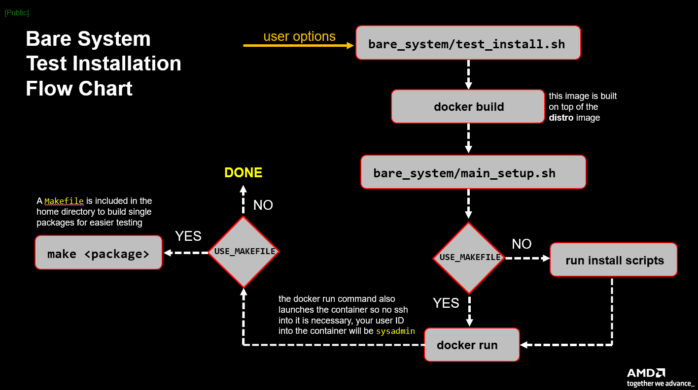

Last review of this README: **September 16, 2025**

# 1. Synopsis

Welcome to AMD's model installation repo!

In this repo, we provide two options to test the installation of a variety of AMD GPU software and frameworks that support running on AMD GPUs:
1. Container Installation (based on **Docker** or **Podman**. **Singularity** can also be used as explained in [Section 1.3](https://github.com/amd/HPCTrainingDock#13-using-singularity-to-build-an-image)). Jupyter-ready images can be built using the instructions in [Section 1.4](https://github.com/amd/HPCTrainingDock#14-jupyer-ready-containers-with-rocm).
2. Bare Metal Installation

## 1.2 Podman Detection

If Podman is installed on your system instead of Docker, the scripts should detect it and automatically include the `--format docker` flag in the `docker build` commands present in our scripts. The detection is done as follows, where `ADD_OPTIONS` will be added to the `docker build` command:
```
ADD_OPTIONS=""
PODMAN_DETECT=$(docker info 2>&1 | grep -i "emulate docker cli using podman" | wc -l)
if [[ "${PODMAN_DETECT}" -ge "1" ]]; then
   ADD_OPTIONS="${ADD_OPTIONS} --format docker"
fi
```

## 1.3 Using Singularity to Build an Image

If Singularity is installed in your system, it is possible to create a Singularity image using the installation scripts in this repo. First, make a new directory from which the Singularity image will be built, and record the location of this directory:

```bash
mkdir singularity_dir
export SINGULARITY_DIR_PATH=$PWD
```

Note that the location where you created the above directory needs to have enough storage space available. Then, start up a Singularity image with the `--sandbox` option, pulling from a plain Docker image for Ubuntu 22.04 (for instance):

```bash
singularity build --sandbox ${SINGULARITY_DIR_PATH}/singularity_dir docker://ubuntu:22.04
```

The next step is to install software in the directory:

```bash
singularity shell -e --writable --fakeroot  -H $PWD:/home ${SINGULARITY_DIR_PATH}/singularity_dir
```

The above command will take care of several things: the `shell` command allows us to run shell scripts in the `singularity_dir`. The input flag `--fakeroot` will make the use of `sudo` not necessary, and the `-e` flag will clear your environment from anything coming from the host (i.e. the system from which you are running Singularity commands) before getting on the `singularity_dir` directory. Finally the `-H` option makes your current directory your home directory once in `singularity_dir`.

**NOTE**: Changes made to host directories modified while using Singularity  will reflect once exited.

Once this command has completed, run `bare_metal/main_setup.sh +options` as explained in [Section 2.2](https://github.com/amd/HPCTrainingDock?tab=readme-ov-file#22-training-enviroment-install-on-bare-system).

The final step is to create a Singularity image from the `singularity_dir` directory:

```bash
singularity build ${SINGULARITY_DIR_PATH}/singularity_image.sif ${SINGULARITY_DIR_PATH}/singularity_dir
```

The above command will create the image `singularity_image.sif` and place it in `SINGULARITY_DIR_PATH`. To run the image do:

```bash
singularity run -e ${SINGULARITY_DIR_PATH}/singularity_image.sif
```

**NOTE**: Once again, note that changes made while on the image to the directories from the host that are mirrored to the image will reflect once you exit the image.

## 1.4 Jupyter-ready Containers with ROCm

It is possible to use the scripts in this repo to build Jupyter-ready containers with ROCm installations. The Dockerfile to use is [this](https://github.com/amd/HPCTrainingDock/blob/main/rocm/Dockerfile.jupyter) one and it should be used as follows to build and run an image. Note that we are assuming you are running the container from a compute node on a system where `podman` is installed and to which system you have to ssh to from your local machine, and then use slurm for instance to get on the compute node.

Log in to your system and allocate a compute node. Then make note of the compute node name by running:
```
hostname
```

Execute the following instructions from the compute node after you cloned the present repo:
```
cd HPCTrainingDock/rocm

podman build --format docker -t jupyter_rocm -f Dockerfile.jupyter --progress=plain
```

This will build an image on the compute node, get the image ID by running:

```
podman images
```

whose output should be similar to:

```
REPOSITORY                      TAG         IMAGE ID      CREATED            SIZE
localhost/jupyter_rocm          latest      78de89459679  About an hour ago  30.8 GB
```

Make note of the `IMAGE ID` and use it the command below to run the image and start a container:

```
podman run -p 10000:8888  --device=/dev/kfd --device=/dev/dri   --group-add=keep-groups --name jupyter_rocm  --security-opt seccomp=unconfined IMAGE_ID
```

Make note of the token that is outputted by the command below, which will look something like this:

```
   To access the server, open this file in a browser:
        file:///home/jovyan/.local/share/jupyter/runtime/jpserver-2-open.html
    Or copy and paste one of these URLs:
        http://localhost:8888/lab?token=5e2969809d46430439856d13c4c10e526ace832024024aac
        http://127.0.0.1:8888/lab?token=5e2969809d46430439856d13c4c10e526ace832024024aac
```

Then, from your local system, run the command below to create the ssh tunnel (`compute_node_name` is what you obtained above when you ran `hostname` from the compute node):
```
ssh -L 10000:compute_node_name:10000 $USER@your.system.login.node
```

Finally, open this on your browser, where the token number is what you took note of above:

```
http://localhost:10000/lab?token=token_number
```

The Dockerfile used here can be customized to use more of the scripts we have in this repo, and create images with a richer software stack than just ROCm.

## 1.5 Operating System Info

Currently, we are mainly focused on Ubuntu, but some support is also available for Red Hat (RockyLinux), Suse and Debian. Work is underway to increase this support.

## 1.6 Supported Hardware

Data Center GPUs, Workstation GPUs and Desktop GPUs are currently supported.

Data Center GPUs (necessary for multi-node scaling as well as more GPU muscle): `AMD Instinct MI300A, MI300X, MI250X, MI250, MI210, MI100, MI50, MI25`

Workstation GPUs (may give usable single GPU performance) : `AMD Radeon Pro W6800, V620, VII`

Desktop GPUs (more limited in memory): `AMD Radeon VII`

**NOTE**: Others not listed may work, but have limited support. A [list]( https://llvm.org/docs/AMDGPUUsage.html#processors)
of AMD GPUs in LLVM docs may help identify compiler support.

# 2. Model Installation Setup Instructions

We currently provide two options for the setup of the software: a container (based on Docker or Podman), and a bare system install. The latter can be tested with a container before deployment.

## 2.1 Training Docker Container Build Steps

These instructions will setup a container on `localhost` and assume that:
1. Docker or Podman are installed.
2. For Docker, your userid is part of the Docker group.
3. For Docker, you can issue Docker commands without `sudo`.

### 2.1.1 Building the Four Images of the Container
The container is set up to pull an OS Docker image depending on the values of the `--distro` and `--distro-version` input flags.
On top of this OS image, it will build four different images called `rocm`, `comm`,  `tools` and `extras`.
Here is a flowchart of the container installation process:
<p>

</p>

This documentation considers version 6.4.1 of ROCm as an example. The ROCm version can be specified at build time as an input flag. The latest version at the time of this README's last update is 6.4.3.

Several compilers and other dependencies will be built as part of the images setup (more on this later). First, clone this repo and go into the folder where the Docker build script lives:

```bash
git clone https://github.com/amd/HPCTrainingDock.git 
cd HPCTrainingDock
```

To build the four images, run the following command (note that `<admin>` is set to `admin` by default but the password **must** be specified, otherwise you will get an error from the build script):

```
   ./build-docker.sh --rocm-versions 6.4.1 --distro ubuntu --distro-version 24.04 --admin-username <admin> --admin-password <password>
```
Note that the default distribution is Ubuntu 24.04 so if you don't specify `--distro` and `--distro-version` that is what you will get. To visualize all the input flags that can be provided to the script, run: `./build-docker.sh --help`.

To show more docker build output, add this option to the build command above:

```bash
--output-verbosity
```

**NOTE**: The docker build script will try and detect the GPU on the system you are building on, but you can also have it build for a different GPU model than your local GPU, by specifying the target architecture with the `--amdgpu-gfxmodel` option. For instance, to build for the MI200 series data center GPU we would provide this:

```bash
--amdgpu-gfxmodel=gfx90a
```

For the MI200 series, the value to specify is `gfx90a`, for the MI300 series, the value is `gfx942`. Note that you can also build the images on a machine that does not have any GPU hardware (such as your laptop) provided you specify a target hardware with the flag above.

Building extra compilers takes a long time, but a cached option can be used  to shorten subsequent build times, just append these options to the build command above:

```bash
--build-gcc-option
--build-aomp-option
```

The first one builds the latest version of `gcc` for offloading, the second builds the latest version of `LLVM` for offloading. Once a version of these compilers is built, they can be tarred up and placed in the following directory structure:

```bash
CacheFiles/:
  ubuntu-22.04-rocm-5.6.0
     aomp_18.0-1.tgz
      gcc-13.2.0.tgz
```

Then, the cached versions can be installed specifying:

```bash
--use-cached-apps
```
The above flag will allow you to use pre-built `gcc` and `aomp` located in `CacheFiles/${DISTRO}-${DISTRO_VERSION}-rocm-${ROCM_VERSION}`.

### 2.1.2 Previewing the Images

Assuming that the build of the images has been successful, you can see details on the images that have been built by doing:

```bash
 docker images
```
which will have an output similar to this one:

```bash
 REPOSITORY           TAG                                    IMAGE ID       CREATED          SIZE
 training             latest                                 fe63d37c10f4   40 minutes ago   27GB
 <admin>/tools       release-base-ubuntu-24.04-rocm-6.4.1   4ecc6b7a80f2   44 minutes ago   18.7GB
 <admin>/comm        release-base-ubuntu-24.04-rocm-6.4.1   37a84bef709a   47 minutes ago   16.1GB
 <admin>/rocm        release-base-ubuntu-24.04-rocm-6.4.1   bd8ca598d8a0   48 minutes ago   16.1GB
```
You can also display the operating system running on the container by doing:

```bash
cat ../../etc/os-release
```

### 2.1.3 Starting the Container

To start the container, run:

```bash
docker run -it --device=/dev/kfd --device=/dev/dri --group-add video -p 2222:22 --detach --name Training --rm -v $HOME/Class/training/hostdir:/hostdir --security-opt seccomp=unconfined docker.io/library/training
```

**NOTE**: If you are testing the container on a machine that does not have a GPU (such as your laptop), you need to remove the `--device=/dev/kfd` option from the above command.

You can check what containers are running by running `docker ps`.

### 2.1.4 Accessing the Container

It is necessary to wait a few seconds for the container to start up, before you will be allowed to login.
After the container started, you can log in by doing:

```bash
ssh <admin>@localhost -p 2222
```
and then enter the password `<password>` specified when building the images. If you get the message below, wait a little longer, the container is still starting up:

```bash
kex_exchange_identification: read: Connection reset by peer
Connection reset by 127.0.0.1 port 2222
```

Once you are in, you can startup slurm with the manage script `manage.sh` located in the `bin` directory. To transfer files from your local system to the container, run:

```bash
rsync -avz -e "ssh -p 2222" <file> <admin>@localhost:<path/to/destination>
```

### 2.1.5 Enable VNC Server in Container

A Graphics User Interface (GUI) can be enabled in the container. There are currently two ways to enable the GUI: one way is through a tunnel to the node launching the container (***Method 1***), the other through a tunnel directly to the container (***Method 2***). The second method is preferable when the information on how to access the node launching the container is not available. The following instructions consider a scenario where multiple hops are necessary, as shown in a sample `.ssh/config` file that should exist in your local system:

```bash
Host Gateway
   HostName Gateway.<site>.com
   User <username> # on Gateway
   Port 22
   IdentityFile ~/.ssh/id_ed25519 # ssh key on local starting system
   ForwardX11 yes

Host Remoteserver
   ProxyJump Gateway
   HostName Remoteserver
   User <username> # on Remoteserver
   Port 22
   IdentityFile ~/.ssh/id_ed25519 # same ssh key file as above, on local system
   ForwardX11 yes

Host Container
   ProxyJump Remoteserver
   Hostname localhost
   Port 2222
   User <username> # on Container
   ForwardX11 yes
   StrictHostKeyChecking no
   IdentityFile ~/.ssh/id_ed25519 # same ssh key file as above, on local system
```

Note that `Remoteserver` refers to the node that is launching the container.
The approach in consideration is summarized in the figure below:

<p>

</p>

In the figure, it is assumed that your local system is either a *Linux Laptop* or a *wsl* terminal from Windows, for example. The following steps  enable a GUI in the container (steps 1.,2.,3.,7.,8.,9.,10. are the same for Method 1 and Method 2):

1. Build the container as in [Section 2.1.1](https://github.com/amd/HPCTrainingDock?tab=readme-ov-file#211--building-the-four-images-of-the-container), but make sure to include this additional input flag: `--build-x11vnc`.
2. Run the container as in [Section 2.1.3](https://github.com/amd/HPCTrainingDock?tab=readme-ov-file#213-starting-the-container), including this additional input flag `-p 5950-5970:5900-5920` after `-p 222:22`.
3. Access the container as shown in [Section 2.1.4](https://github.com/amd/HPCTrainingDock?tab=readme-ov-file#214-accessing-the-container).
---------------------------------------------------------------------------------------------------------------
#### Method 1
4. Access the node that is launching the container using ssh and copy-paste the content of the ssh public key in your local system to `.ssh/authorized_keys` in the node launching the container.
5. From the container, run `/usr/local/bin/startvnc.sh` which will produce some output, the relevant part will look something like:
```bash
or connect your VNC viewer to localhost:<port_number> with password <password>
```
From the above output, take note of the `<password>`.

6. To encrypt the network traffic, pass the VNC connection through the ssh tunnel by going on your local system and running
```bash
ssh -L 5950:localhost:5950 -N -f <username>@Remoteserver
```

where `<username>` is the username you use to ssh into the `Remoteserver`.

---------------------------------------------------------------------------------------------------------------
#### Method 2
4. Access the container using ssh and copy-paste the content of the ssh public key in your local system to `.ssh/authorized_keys` in the container.
5. From the container, run `/usr/local/bin/startvnc.sh` which will produce some output, the relevant part will look something like:
```bash
or connect your VNC viewer to localhost:<port_number> with password <password>
```
From the above output, take note of the `<port_number>` and `<password>`.

6. To encrypt the network traffic, pass the VNC connection through ssh the tunnel by going on your local system and running
```bash
ssh -L 5950:localhost:<port_number> -N -f <username>@Container
```

where `<username>` is the username you use to ssh into the `Container`, and `<port_number>` is the one given on Step 5.

---------------------------------------------------------------------------------------------------------------

7. Install `remmina` from terminal:
```bash
sudo apt-get update
sudo apt-get install remmina
```
8. Launch the `remmina` GUI from terminal:
```bash
remmina &
```
9. From the remmina GUI, click on the icon on the top left corner (the one including the plus sign) and make the following selection:
```bash
Protocol: Remmina VNC Plugin
Server: localhost:5950
Username: <username>
```
Then click on the *Advanced* tab, and check the box for *Forget passwords after use*.
Click on *Save and Connect*, then type the `<password>` noted from Step 5. This will open the Remmina VNC window.

10. In the bottom left of the VNC window, click on the terminal icon to access the terminal from the container.
Note that desktop directories will be added to your container home.

#### Troubleshooting

It is recommended to test each ssh access before opening the tunnel, by doing:
```bash
ssh Remoteserver
ssh Container
```
as needed.

Note also that the ssh tunnel will persist until it is destroyed. To show what tunnels currently exist, from your local system, search for *ssh* in the output of the following command:
```bash
ps -ef
```
Then you can kill the process by running:
```bash
kill <process_ID>
```


### 2.1.6 Killing the Container and Cleaning Up your System

To exit the container, just do:
```bash
exit
```
Note that the container will still be running in the background. To kill it, do:

```bash
docker kill Training
```

To clean up your system (**check that the only containers and images running are yours**), run:

```bash
docker rmi -f $(docker images -q)
docker system prune -a
```

## 2.2 Training Enviroment Install on Bare System

In this section, we provide instructions on how to install AMD GPU software on a bare system. This is achieved with the same set of scripts used for the setup of the container, except that instead of being called from within a Dockerfile, they are called from a top level script that does not require the use of Docker. There is however a script called `test_install.sh` that will run a Docker container to test the bare system install.

To test the bare system install, do:

```bash
git clone https://github.com/amd/HPCTrainingDock.git && \
cd HPCTrainingDock && \
./bare_system/test_install.sh --rocm-version <rocm-version>
```
In addition, the Linux distro version can be specified (default is Ubuntu 24.04). Some of those tried are:

```bash
--distro ubuntu
--distro rockylinux
--distro opensuse/leap
```

The above command sequence will clone this repo and then execute the `test_install.sh` script. This script calls the `main_install.sh` which is what you would execute to perform the actual installation on your system. The `test_install.sh` sets up a Docker container where you can test the installation of the software before proceeding to deploy it on your actual system by running `main_install.sh`. The `test_install.sh` script automatically runs the Docker container after it is built, and you can inspect it as `sysadmin`. Here is a flowchart of the process initiated by the script:

<p>

</p>

As seen from the image above, setting the `--use-makefile 1` option will bypass the installation of the scripts and automatically get you on the container, on which packages can be installed with `make <package>` and then tested with `make <package_tests>`.
To visualize all the input flags that can be provided to the script, run: `./bare_system/test_install.sh --help`.

If you are satisfied with the test installation, you can proceed with the actual installation on your system by doing:

```bash
git clone --recursive git@github.com:amd/HPCTrainingDock.git && \
cd HPCTrainingDock && \
./bare_system/main_setup.sh --rocm-version <rocm-version> + other options
```

The above command will execute the `main_install.sh` script on your system that will proceed with the installation for you. Note that you need to be able to run `sudo` on your system for things to work.  To visualize all the input flags that can be provided to the script, run: `./bare_system/main_setup.sh --help`.
The `main_install.sh` script calls a series of other scripts to install the software (these are given several runtime flags that are not reported here for simplicity): packages are added routinely so the best way to see what will be installed is to open `main_setup.sh` and inspect it. Note that each of these single scripts can be run individually to install a single package. These are all listed in the `rocm`, `comm`, `tools` and `extras` directories. 

**NOTE**: As mentioned before, the scripts called from within `main_setup.sh`  are the same used by the Docker containers (either the actual training Docker container or the test Docker container run by `test_install.sh`). The reason why the script work for both installations (bare system and Docker) is because the commands are executed at the `sudo` level. Since Docker is already at the `sudo` level, the instructions in the scripts work in both contexts. 

**NOTE**: There is also the option to install a package in a directory where the user has write access. In that case, `sudo` will not be used. Just make sure that the install path and module file path exist and the user has write access to those. When launching a single script, provide the install path and module file path as input arguments to the script. The script will check whether the directories exist and if the user has write access. If both are true, then no `sudo` will be used.

### 2.2.1 Alternative installation directory for ROCm

There is a possibility to install ROCm outside of the usual `/opt/`. `test_install.sh` and `main_install.sh` scripts have optional argument `--rocm-install-path` which allows to specify the desired path for ROCm:

```bash
./bare_system/test_install.sh --rocm-version <rocm-version> --rocm-install-path <new_path>
```

If the argument `--rocm-install-path` is specified, installation scripts will first install ROCm to the usual `/opt/` path, then move it to the `<new_path>` location, and finally update `/etc/alternatives/rocm` and module files.

**NOTE**: In general, if you are moving the ROCm folder outside of the usual `/opt/`, it is very important not to forget to update the new path in all of its dependencies and module files.

### 2.2.2 Enable VNC Server to Test Bare Metal Scripts

It is possible to enable the VNC server for the container that is brought up by the `test_install.sh` script. To do so, first add the following to your `.ssh/config`:

```bash
Host Makefile
   ProxyJump Remoteserver
   Hostname localhost
   Port 2222
   User sysadmin
   ForwardX11 yes
   StrictHostKeyChecking no
   IdentityFile ~/.ssh/id_ed25519 # ssh key file on local system
```

Then, proceed with these steps:

1. Run `./bare_system/test_install.sh --rocm-version <rocm_version> --use-makefile 1`.
2. Once in the container, run  `make x11vnc`.
3. From the container, run `sudo service ssh start` to start the ssh process.
4. On the container do: `mkdir .ssh`.
5. Then: `touch .ssh/authorized_keys`.
6. Copy-paste the ssh public key on your local system to the `.ssh/authorized_keys` file in the container.
7. Test on the local system that `ssh Makefile` let's you log in into the container.
8. Run from the container: `/usr/local/bin/startvnc.sh` and record the `<port_number>` and `<password>` outputted by this command.
9. From your local system, open the ssh tunnel: `ssh -L 5950:localhost:<port_number> -N -f sysadmin@Makefile`, where `<port_number>` is the one recorded at Step 8.
10. Install `remmina` from terminal:
```bash
sudo apt-get update
sudo apt-get install remmina
```
11. Launch the `remmina` GUI from terminal:
```bash
remmina &
```
12. From the remmina GUI, click on the icon on the top left corner (the one including the plus sign) and make the following selection:
```bash
Protocol: Remmina VNC Plugin
Server: localhost:5950
Username: sysadmin
```
Then click on the *Advanced* tab, and check the box for *Forget passwords after use*.
Click on *Save and Connect*, then type the `<password>` noted from Step 8. This will open the Remmina VNC window.

13. In the bottom left of the VNC window, click on the terminal icon to access the terminal from the container.

# 3. Inspecting the Model Installation Environment

The training environment comes with a variety of modules installed, with their necessary dependencies. To inspect the modules available, run `module avail`, which will show you this output (assuming the installation has been performed with ROCm 6.4.1):

```bash
--------------------------------------------------------------------- /etc/lmod/modules/Linux ----------------------------------------------------------------------
   clang/base    gcc/base

------------------------------------------------------------------- /etc/lmod/modules/LinuxPlus --------------------------------------------------------------------
   miniconda3/25.3.1    miniforge3/24.9.0

---------------------------------------------------------------------- /etc/lmod/modules/ROCm ----------------------------------------------------------------------
   amdclang/19.0.0-6.4.1           hipfort/6.4.1    rocm/6.4.1                       rocprofiler-sdk/6.4.1
   amdflang-new/rocm-afar-7.0.5    opencl/6.4.1     rocprofiler-compute/6.4.1 (D)    rocprofiler-systems/6.4.1 (D)

-------------------------------------------------------------------- /etc/lmod/modules/ROCmPlus --------------------------------------------------------------------
   adios2/2.10.1    hdf5/1.14.6                   hypre/2.33.0     netcdf-c/4.9.3          petsc/3.23.1    tau/dev
   fftw/3.3.10      hpctoolkit/2024.01.99-next    kokkos/4.6.01    netcdf-fortran/4.6.2    scorep/9.0

------------------------------------------------------------------ /etc/lmod/modules/ROCmPlus-MPI ------------------------------------------------------------------
   mpi4py/4.0.3    openmpi/5.0.7-ucc1.4.4-ucx1.18.1

----------------------------------------------------------- /etc/lmod/modules/ROCmPlus-AMDResearchTools ------------------------------------------------------------
   rocprofiler-compute/develop    rocprofiler-systems/develop

------------------------------------------------------------ /etc/lmod/modules/ROCmPlus-LatestCompilers ------------------------------------------------------------
   hipfort_from_source/6.4.1

------------------------------------------------------------------ /etc/lmod/modules/ROCmPlus-AI -------------------------------------------------------------------
   cupy/14.0.0a1    ftorch/dev    jax/0.6.0    pytorch/2.7.1_tunableop_enabled    pytorch/2.7.1 (D)    tensorflow/merge-250318

---------------------------------------------------------------------- /etc/lmod/modules/misc ----------------------------------------------------------------------
   hipifly/dev

  Where:
   D:  Default Module
```

The modules are searched in the `MODULEPATH` environment variable, which is set during the images creation. To see what environment variables the module is setting, run:
```bash
module show <module>
```
where `<module>` is the module you want to inspect. For example, `module show cupy` will show (in case ROCm 6.2.1 has been selected at build time):

```bash
whatis("HIP version of CuPy")
load("rocm/6.4.1")
prepend_path("PYTHONPATH","/opt/rocmplus-6.4.1/cupy")
```

# 4. Adding Your Own Modules

As a simple example, below we show how to install `Julia` as a module in your home directory within the container. Note that we are using Julia as an example here due to the simplicity of its installation. However, because it stores data in the user's home directory, there is discussion on the best way to supply Julia to users and the argument is to have users install it in their home directory rather than have sys admins provide a module for them (more details on this approach at [this](https://juliahpc.github.io/sysadmin_julia/) link).
First, install the Julia installation manager Juliaup:

```bash
curl -fsSL https://install.julialang.org | sh -s -- --yes --add-to-path=no -p=$HOME/julia_install
exit
```
Specifying the `-p` flag above, will select the location of the Julia binaries.
Then, add the Julia binaries `juliaup` and `julia` to your path:

```bash
export PATH=$PATH:$HOME/julia_install/bin
```

To see what versions of `Julia` can be installed do:

```bash
juliaup list
```

Once you selected the version you want (let's assume it's 1.12), you can install it by doing:

```bash
juliaup add 1.12
```

The package will be installed in `$HOME/.julia/juliaup`. Then, set it is a default with

```bash
juliaup default 1.12
```
You can type `juliaup status` to check that it has indeed been set as default. You will also see all the Julia versions currently installed.
To create a module for Julia, create a directory where you have write access, say:

```bash
mkdir -p $HOME/modules
```

Next, add `modules` to the `MODULE_PATH` environment variable by doing: 

```bash
module use --append $HOME/modules
```

Next, do:

```
cd $HOME/modules
mkdir julia
cd julia
touch 1.12.lua
vi 1.12.lua
```

Copy paste the lines below in `1.11.5.lua` and save:

```bash
whatis("Julia Version 1.12")
append_path("PATH", "$HOME/julia_install/bin")
```

Now, `module avail` will show this additional module:

```bash
-------------------------------------------------------------------------------- $HOME/modules --------------------------------------------------------------------------------
   julia/1.12
```

To install the `AMDGPU` package to enable running on AMD GPUs, do:

```
module load julia
julia -e 'using Pkg; Pkg.add("AMDGPU")'
```

# 5. Testing the Installation

A test suite to test the installation of the software is available at https://github.com/amd/HPCTrainingExamples.git
There are currently two ways to test the success of the installation:
1. Directly: clone the repo and run the test suite. This option can be used both with the training container and with the bare system install scripts, with either the `main_setup.sh` (when performing the actual installation) or with the `test_install.sh` (when testing the installation before deployment).
2. With the Makefile build of the test installation: run `make <package>` followed by `make <package_tests>`. Note that this option only applies when doing a test installation using `test_install.sh` and specifying `--use-makefile 1` when launching the script.

## 5.1 Testing the Installation Directly

To test the installation directly, do:

```bash
git clone https://github.com/amd/HPCTrainingExamples.git
cd HPCTrainingExamples/tests
./runTests.sh --<key_word>
```

If no `--<key_word>` is specified, all tests will be run. Depending on the installed software, one may want to run only a subset of the tests, e.g., to run only OpenMPI tests do:

```bash
./runTests.sh --openmpi
```
Run
```bash
./runTests.sh --help
```
to see what are the possible options.

## 5.2 Testing the Installation with Makefile

To test the installation using the Makefile run:

```bash
git clone https://github.com/AMD/HPCTrainingDock
cd HPCTrainingDock
./bare_system/test_install.sh --use-makefile 1
```
**NOTE**: If `--distro` and `--distro-versions` are left out, the test install script will detect the current distro and distro version on the system where the script is being run and use that. If `--rocm-version` is left out, the script also tries to detect the current ROCm version on your system and use that as default. As explained, the above script will automatically get you into a container as `sysdamin`. Once in the container do:

```bash
make <package>
make <package_tests>
```

For instance, for CuPy: `make cupy`, followed by `make cupy_tests`.

# 6. Create a Pre-built Binary Distribution of ROCm

It is possible to create a binary distribution of ROCm by taring up the `rocm-<rocm-version>` directory. Then, the next build will restore from the tar file. This can reduce the build time for the subsequent test installs. For example, considering the 6.4.1 version of ROCm and Ubuntu as distro as an example, do:

```bash
git clone https://github.com/AMD/HPCTrainingDock
cd HPCTrainingDock
bare_system/test_install.sh --distro ubuntu --distro-versions 24.04 --rocm-version 6.4.1 --use-makefile 1
make rocm_package
```
This make command tars up the `rocm-6.4.1` directory and then the next build it will restore from the tar file.

# 7. Installing HIP Software on an Nvidia Machine

The HIP portability layer works across different GPU vendors, and one often wants to test their HIP codes on machines without AMD GPUs. In such scenarios, installing the whole ROCm software stack might be too heavyweight a solution.

Therefore, we provide example scripts [`extras/scripts/build_hip-6.1.0`](https://github.com/amd/HPCTrainingDock/blob/main/extras/scripts/build_hip-6.1.0.sh), [`extras/scripts/build_hip-6.3.0`](https://github.com/amd/HPCTrainingDock/blob/main/extras/scripts/build_hip-6.3.0.sh) and [`extras/scripts/build_hip-7.0.1`](https://github.com/amd/HPCTrainingDock/blob/main/extras/scripts/build_hip-7.0.1.sh) for installing specific HIP packages from source. Note that these scripts worked for users on a cluster with Intel Xeon Platinum 8360Y CPUs + Nvidia A100 GPUs with SLES 15.6 OS. These scripts have not been thoroughly tested on different systems, but can serve as a good starting point for any similar installations.

# 8. Additional Resources

Please see: https://github.com/amd/InfinityHub-CI for a list of instructions on how to run a variety of scientific application codes on AMD GPUs. The repository mostly deals with Docker containers, but some Bare Metal installs are also available.

# 9. Feedback and Contributions

We very much welcome user experience and feedback, please feel free to reach out to us by creating pull requests or opening issues if you consider it necessary. We will get back to you as soon as possible. For information on licenses, please see the `LICENSE.md` file.
